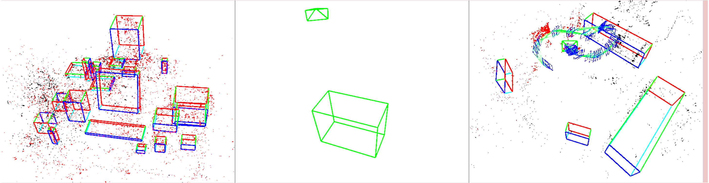
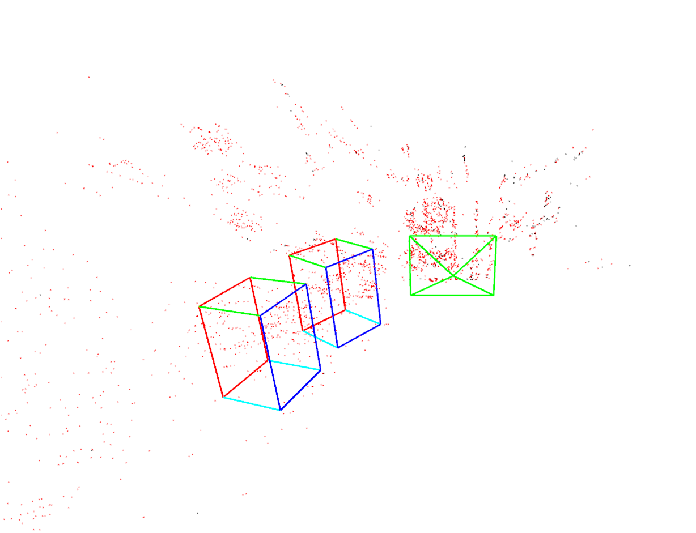
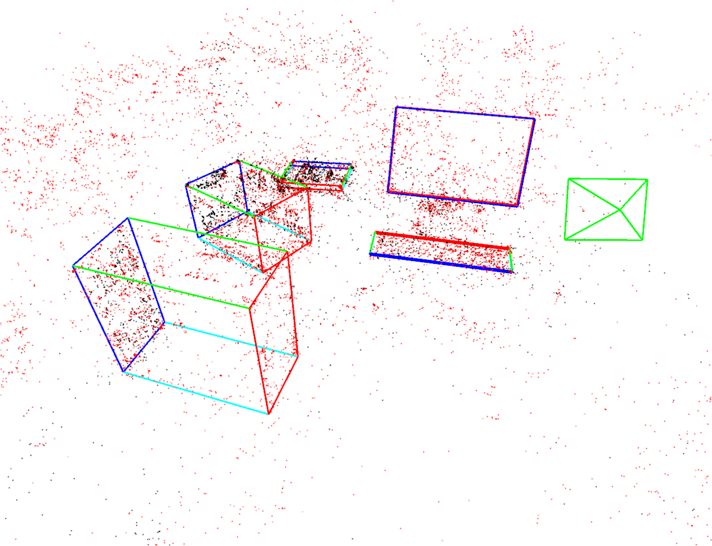
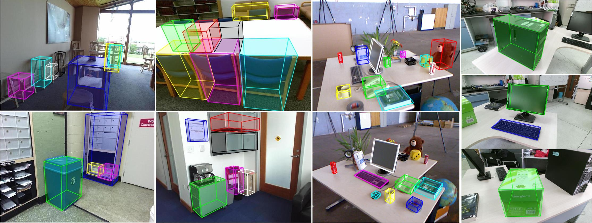

# TiMoSLAM
## Bridging the Gap between Semantics and Geometry in SLAM: A Semantic-Geometric Tight-coupling Monocular Visual Object SLAM System

## 1. Introduction
**TiMoSLAM** considers a rigorous correspondence between semantics and geometry across all steps of SLAM. Initially, a general Semantic Relation Graph (SRG) is developed to consistently represent semantic information alongside geometric features. Detailed analyses on complete constraints of the geometric feature combinations on estimation of 3D cuboid model are performed. Subsequently, a Compound Hypothesis Tree (CHT) is proposed to incrementally construct the object-specific SRG and concurrently estimate the 3D cuboid model of an object, ensuing semantic-geometric consistency in object representation and estimation. Special attention is given to the matching errors between geometric features and objects during the optimization of camera poses and object parameters. The effectiveness of this method is validated on various datasets, as well as in real-world environments.

    

Fig.1 The reconstructed object maps of TiMoSLAM in TUM fr2_desk, TUM fr3_cabinet and ICL room2.

 

Fig. 2 The object maps construct by TiMoSLAM in two real-world scenes.

 

Fig. 3 The 3D object detection results.

## 2. Installation

	git clone https://github.com/Linking1/TiMoSLAM.git

### 2.1 Required Dependencies

#### Its dependencies is the same with ORB-SLAM.

### 2.2 Optional Dependencies

#### OpenCV (highly recommended).
Used to read / write / display images.
Feel free to implement your own version of these functions with your prefered library, 
if you want to stay away from OpenCV.

Install with

	sudo apt-get install libopencv-dev

### 2.3 Build
#### 3D Object Detection

	cd TiMoSLAM/ObjDetectionIT
	mkdir build
	cd build
	cmake ..
	make -j4
	
OpenCV need to be installed.

#### Object SLAM
	cd TiMoSLAM/ObjectSLAM
	./build.sh
You need to download the [TUM fr3_cabinet](https://cvg.cit.tum.de/rgbd/dataset/freiburg3/rgbd_dataset_freiburg3_cabinet.tgz), and the vocabulary, which should be put in "/Vocabulary".

## 3 Running

### 3.1 3D Object Detection
#### Run on an image from TUM fr3_cabinet (the "test.png" in "data") using

		./3D_detect ../data/test.png

#### Select the object
You need to mark the object to be detected with a rectangular box, just like the gif.
1. Press the left mouse button in the up-left corner of the bounding box.
2. Drag down to the right.
3. Release the left mouse button in the low-right corner of the bounding box.
4. Press "ESC" to start running.

Fig. 4 The operation process of 3D object detection.

### 3.2 Object SLAM
It is the same with ORB-SLAM
1. Download the [TUM fr3_cabinet](https://cvg.cit.tum.de/rgbd/dataset/freiburg3/rgbd_dataset_freiburg3_cabinet.tgz) sequence and uncompress it.

2. Execute the following command. Change TUMX.yaml to TUM3.yaml. Change PATH_TO_SEQUENCE_FOLDER to the uncompressed sequence folder.

		./Examples/Monocular/mono_tum Vocabulary/ORBvoc.txt Examples/Monocular/TUMX.yaml PATH_TO_SEQUENCE_FOLDER

Fig. 5 The videos of TiMoSLAM in TUM fr3_cabinet and a real-world scenes.

## 4 Notation
Thank you very much, [CubeSLAM](https://github.com/shichaoy/cube_slam). This is the source of inspiration for this paper. The code of Object SLAM released now is exclusive to TUM fr3_cabinet. After the paper is received, the complete code will be released.

## 5 License
TiMoSLAM was developed at the Nankai University of Tianjin, China.
The open-source version is licensed under the GNU General Public License
Version 3 (GPLv3).
